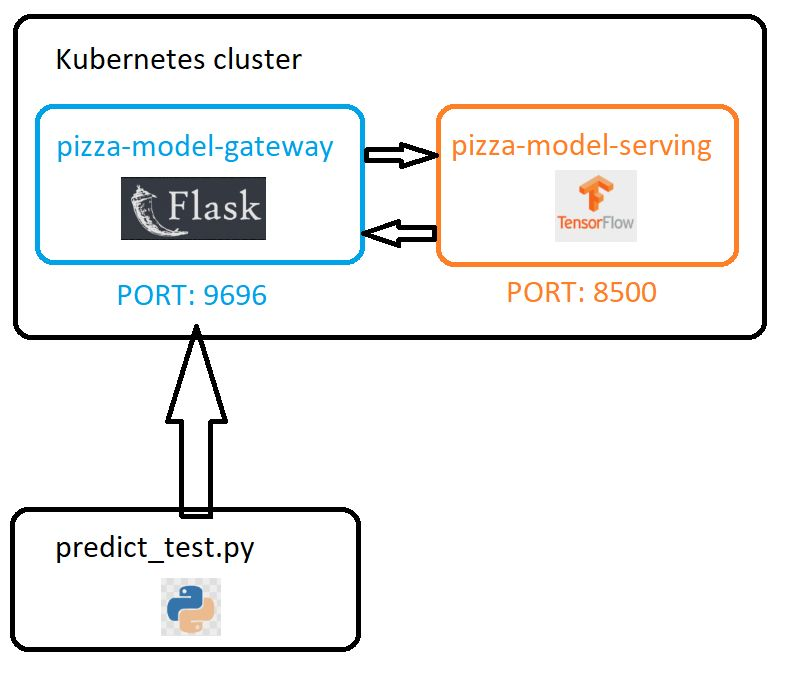

# Identify whether a pizza is shown in the image
## Objective

This repository contains the final project for the [Machine Learning Zoomcamp](https://github.com/DataTalksClub/machine-learning-zoomcamp) course provided by [DataTalks.Club](https://datatalks.club/).

The goal of the project is to apply what we have learned during the course. This project aims to develop an exemplary Kubernetes cluster deployment using [Kind](https://kind.sigs.k8s.io/docs/user/quick-start/) for [TensorFlow Serving](https://www.tensorflow.org/tfx/guide/serving) architecture. The binary image classifier attempts to determine whether an image shows a pizza. The overview of the approach is explained in following [video](https://github.com/DataTalksClub/machine-learning-zoomcamp/blob/master/11-kserve/05-tensorflow-kserve.md).

In summary, the cluster consists of two services. One is responsible for serving a model, while the other handles traffic maintenance. The latter is referred to as a LoadBalancer, which acts as a gateway for requests sent to the cluster. Requests are registered and forwarded thanks to port forwarding between architectural components.

The following video shows how the project works in a humorous way (click the image below to start short youtube video):

*Image from Silicon Valley TV show, created by Mike Judge, John Altschuler, and Dave Krinsky.*

## Dataset

The dataset used to train the image classifier can be found on [Kaggle](https://www.kaggle.com/datasets/carlosrunner/pizza-not-pizza). You can download the dataset directly from there or explore it via [Kaggle](https://www.kaggle.com/) itself.

Due to the nature of the problem - a binary image classifier - conducted exploratory data analysis (EDA) was very elementary. The dataset consists of 983 pizza images and 983 non-pizza images. Please refer to the notebook titled: [01_eda](https://github.com/KonuTech/machine-learning-zoomcamp-capstone-02/blob/main/notebooks/01_eda.ipynb).

## Training

The experiments conducted resulted in several different training runs, using various architectures of CNN (convolutional neural networks). Various versions of pre-trained models were employed in the hope of improving the quality of the champion model. The impact of so-called Transfer Learning can be observed both [here](https://github.com/KonuTech/machine-learning-zoomcamp-capstone-02/blob/main/notebooks/02_get_champion_binary_classifier.ipynb) and on [Kaggle](https://www.kaggle.com/code/konutech/machine-learning-zoomcamp-pizza-classifier/notebook), where you can run the notebook responsible for training the champion model yourself.

The list of pre-trained models used in experiments where the so-called transfer learning approach was applied:
* Xception
* EfficientNetB3
* InceptionV3
* EfficientNetB5
* VGG16

## Model deployment and serving

The model was first tested as a containerized Flask app. Afterwards, the model was served as a Kind Kubernetes cluster. To see how to apply the model, look into the details below.

### Applied technologies

| Name | Scope |
| --- | --- |
| Jupyter Notebooks | EDA, experiments, scoring |
| TensorFlow | pre-processing, feature engineering, transfer learning, serving|
| Flask | web service |
| pylint | Python static code analysis |
| black | Python code formatting |
| isort | Python import sorting |
| Docker Desktop | Containerization of servicesc |
| Kind | Kubernetes cluster |

### Architecture

Here is a high-level schema of an architecture:

### Peer review criterias - a self assassment:
* Problem description
    * 2 points: The problem is well described and it's clear what the problem the project solves
* EDA
    * 2 points: Extensive EDA (ranges of values, missing values, analysis of target variable, feature importance analysis)
* Model training
    * 3 points: Trained multiple models and tuned their parameters.
* Exporting notebook to script
    * 1 point: The logic for training the model is exported to a separate script
* Reproducibility
    * 1 point: It's possible to re-execute the notebook and the training script without errors. The dataset is committed in the project repository or there are clear instructions on how to download the dat 
* Model deployment
    * 2 points: Model is deployed (with Flask, BentoML or a similar framework)
* Dependency and enviroment managemen
    * 2 points: Provided a file with dependencies and used virtual environment. README says how to install the dependencies and how to activate the env.
* Containerization
    * 2 points: There's code for deployment to cloud or kubernetes cluster (local or remote). There's a URL for testing - or video/screenshot of testing it.
* Cloud deployment
    * 0 points: No deployment to the cloud