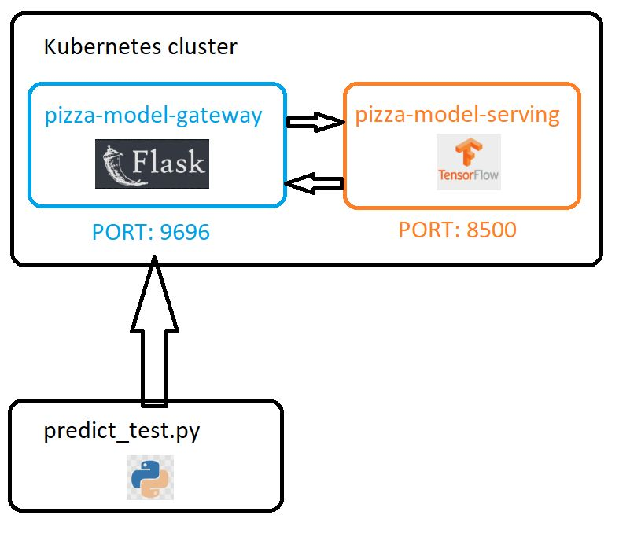

# Identify whether a pizza is shown in the image
## Objective

This repository contains the final project for the [Machine Learning Zoomcamp](https://github.com/DataTalksClub/machine-learning-zoomcamp) course provided by [DataTalks.Club](https://datatalks.club/).

The goal of the project is to apply what we have learned during the course. This project aims to develop an exemplary Kubernetes cluster deployment using [Kind](https://kind.sigs.k8s.io/docs/user/quick-start/) for [TensorFlow Serving](https://www.tensorflow.org/tfx/guide/serving) architecture. The binary image classifier attempts to determine whether an image shows a pizza. The overview of the approach is explained in following [video](https://github.com/DataTalksClub/machine-learning-zoomcamp/blob/master/11-kserve/05-tensorflow-kserve.md).

In summary, the cluster consists of two services. One is responsible for serving a model, while the other handles traffic maintenance. The latter is referred to as a LoadBalancer, which acts as a gateway for requests sent to the cluster. Requests are registered and forwarded thanks to port forwarding between architectural components.

The following video shows how the project works in a humorous way
(click the image below to start short youtube video):

[](https://youtu.be/tWwCK95X6go?si=LPqjv3k_NyPgqaAq)

*Image from Silicon Valley TV show, created by Mike Judge, John Altschuler, and Dave Krinsky.*

## Dataset

The dataset used to train the image classifier can be found on [Kaggle](https://www.kaggle.com/datasets/carlosrunner/pizza-not-pizza). You can download the dataset directly from there or explore it via [Kaggle](https://www.kaggle.com/) itself.

Due to the nature of the problem - a binary image classifier - conducted exploratory data analysis (EDA) was very elementary. The dataset consists of 983 pizza images and 983 non-pizza images. Please refer to the notebook titled: [01_eda](https://github.com/KonuTech/machine-learning-zoomcamp-capstone-02/blob/main/notebooks/01_eda.ipynb).

## Training

The experiments conducted resulted in several different training runs, using various architectures of CNN (convolutional neural networks). Various versions of pre-trained models were employed in the hope of improving the quality of the champion model. The impact of so-called Transfer Learning can be observed both [here](https://github.com/KonuTech/machine-learning-zoomcamp-capstone-02/blob/main/notebooks/02_get_champion_binary_classifier.ipynb) and on [Kaggle](https://www.kaggle.com/code/konutech/machine-learning-zoomcamp-pizza-classifier/notebook), where you can run the notebook responsible for training the champion model yourself.

The list of pre-trained models used in experiments where the so-called transfer learning approach was applied:
* Xception
* EfficientNetB3
* InceptionV3
* EfficientNetB5
* VGG16

## Model deployment and serving

The model was first tested as a containerized Flask app. Afterwards, the model was served as a Kind Kubernetes cluster. To see how to apply the model, look into the details below.

### Applied technologies

| Name | Scope |
| --- | --- |
| Jupyter Notebooks | EDA, experiments, scoring |
| TensorFlow | pre-processing, feature engineering, transfer learning, serving|
| Flask | web service |
| pylint | Python static code analysis |
| black | Python code formatting |
| isort | Python import sorting |
| Docker Desktop | Containerization of servicesc |
| Kind | Kubernetes cluster |

### Architecture

Here is a high-level schema of an architecture:


Project Structure
------------
    ├── data
    │   ├── pizza_not_pizza
    │   ├── not_pizza
    │   ├── pizza
    ├── k8s
    │   ├── pizza-model
    │   │   ├── assets
    │   │   ├── variables
    ├── models
    ├── notebooks
    │   ├── training_logs
    │   │   ├── pizza_classification
    │   │   │   │   ├── 20240106-175439
    │   │   │   │   ├── train
    │   │   │   │   ├── validation
    |   │   │   │   ├── 20240106-181636
    │   │   │   │   ├── train
    │   │   │   │   ├── validation
    |
    |
    |
    ├── scoring
    │   ├── logs
    │   ├── models

## Reproducibility

##### Pre-requisties

* python 3.9 or above.
* Docker Desktop, Kind, kubectl
* pip3, pipenv
* git-lfs

### Docker deployment

##### Dependencies
The list of dependencies for a deployment using Kind is available [here](https://github.com/KonuTech/machine-learning-zoomcamp-capstone-02/blob/main/k8s/Pipfile).
As always first do the following:
```
pip install pipenv
pipenv shell
```
Next, install dependencies listed under Pipfile using following command:
```
pipenv install
```

### Kind deployment (Kubernetes)

We are going to use the tool [Kind](https://kind.sigs.k8s.io/docs/user/quick-start/) to create a Kubernetes cluster locally. A single pod is created for each of the services: one pod for a model-serving service and another pod for the creation of a so-called gateway. This is illustrated in the architecture schema image shown previously.

Here, I am assuming that you were aleady able to instal [Docker Desktop for Windows](https://docs.docker.com/desktop/install/windows-install/). 

##### Prerequisites

If you are a Windows user you can download Kind using following URL:

```
curl.exe -Lo kind-windows-amd64.exe https://kind.sigs.k8s.io/dl/v0.20.0/kind-windows-amd64
Move-Item .\kind-windows-amd64.exe c:\kind\kind.exe
```

Next you can create a cluster with:
```
PS C:\kind> .\kind.exe create cluster
```
You should see:
```
Creating cluster "kind" ...
 • Ensuring node image (kindest/node:v1.27.3) 🖼  ...
 ✓ Ensuring node image (kindest/node:v1.27.3) 🖼
 • Preparing nodes 📦   ...
 ✓ Preparing nodes 📦
 • Writing configuration 📜  ...
 ✓ Writing configuration 📜
 • Starting control-plane 🕹️  ...
 ✓ Starting control-plane 🕹️
 • Installing CNI 🔌  ...
 ✓ Installing CNI 🔌
 • Installing StorageClass 💾  ...
 ✓ Installing StorageClass 💾
Set kubectl context to "kind-kind"
You can now use your cluster with:

kubectl cluster-info --context kind-kind

Thanks for using kind! 😊
```
Check if cluster is up and running with:
```
PS C:\kind> kubectl cluster-info --context kind-kind
```
You should see something like following:
```
Kubernetes control plane is running at https://127.0.0.1:59542
CoreDNS is running at https://127.0.0.1:59542/api/v1/namespaces/kube-system/services/kube-dns:dns/proxy

To further debug and diagnose cluster problems, use 'kubectl cluster-info dump'.
```
Next, load Docker images into the cluster:
```
C:\kind>kind load docker-image machine-learning-zoomcamp-capstone-02:xception-001
Image: "machine-learning-zoomcamp-capstone-02:xception-001" with ID "sha256:5e45971598ba189a7bd5f36a182a2e27272303a35a498cfa0a2574ba357e8ffd" not yet present on node "kind-control-plane", loading...

C:\kind>.\kind.exe load docker-image machine-learning-zoomcamp-capstone-02-gateway:001
Image: "machine-learning-zoomcamp-capstone-02-gateway:001" with ID "sha256:8168d041ad2e8d9f0c227fd5b9b56e1db4236c6e8766cc094d086866fa66e480" not yet present on node "kind-control-plane", loading...
```
Now, we can create resources from .yaml files:
```
$ kubectl apply -f model-deployment.yaml
deployment.apps/tf-serving-pizza-model created

$ kubectl apply -f gateway-deployment.yaml
deployment.apps/gateway created

$ kubectl apply -f model-service.yaml
service/tf-serving-pizza-model created

kubectl apply -f gateway-service.yaml
deployment.apps/gateway created
```
We can check any running pod or service:
```
$ kubectl get pod
NAME                                     READY   STATUS    RESTARTS        AGE
gateway-549c6cb9bc-bszf8                 1/1     Running   5 (3h14m ago)   3d23h
tf-serving-pizza-model-c956959f9-rdhqv   1/1     Running   5 (3h14m ago)   4d1h

$ kubectl get services
NAME                     TYPE           CLUSTER-IP      EXTERNAL-IP   PORT(S)        AGE
gateway                  LoadBalancer   10.96.189.170   <pending>     80:30322/TCP   3d23h
kubernetes               ClusterIP      10.96.0.1       <none>        443/TCP        40d
tf-serving-pizza-model   ClusterIP      10.96.115.145   <none>        8500/TCP       4d1h
```
The last thing to do is to forward ports:
```
kubectl port-forward tf-serving-pizza-model-c956959f9-rdhqv 8500:8500
kubectl port-forward gateway-549c6cb9bc-bszf8 9696:9696
kubectl port-forward service/gateway 8080:80
```

##### Testing with python script
Now, since the ports were forwared we can try to make a prediction:
```
python k8s/predict_test.py
```
After that we can confirm if the prediction was done thanks to the log from the gateway:
```
$ kubectl logs gateway-549c6cb9bc-bszf8
[2024-01-13 08:59:42 +0000] [1] [INFO] Starting gunicorn 21.2.0
[2024-01-13 08:59:42 +0000] [1] [INFO] Listening at: http://0.0.0.0:9696 (1)
[2024-01-13 08:59:42 +0000] [1] [INFO] Using worker: sync
[2024-01-13 08:59:42 +0000] [10] [INFO] Booting worker with pid: 10
2024-01-13 08:59:44.013754: W tensorflow/stream_executor/platform/default/dso_loader.cc:64] Could not load dynamic library 'libcudart.so.11.0'; dlerror: libcudart.so.11.0: cannot open shared object file: No such file or directory
2024-01-13 08:59:44.013866: I tensorflow/stream_executor/cuda/cudart_stub.cc:29] Ignore above cudart dlerror if you do not have a GPU set up on your machine.
2024-01-13 12:15:29,210 - DEBUG - Received URL for prediction: https://m.kafeteria.pl/shutterstock-84904912-9cb8cae338,730,0,0,0.jpg
2024-01-13 12:15:29,482 - DEBUG - Sending prediction request to TensorFlow Serving.
2024-01-13 12:15:30,713 - DEBUG - Received prediction response from TensorFlow Serving.
2024-01-13 12:15:30,713 - DEBUG - Prediction result: It's a pizza!
```


### Peer review criterias - a self assassment:
* Problem description
    * 2 points: The problem is well described and it's clear what the problem the project solves
* EDA
    * 2 points: Extensive EDA (ranges of values, missing values, analysis of target variable, feature importance analysis)
* Model training
    * 3 points: Trained multiple models and tuned their parameters.
* Exporting notebook to script
    * 1 point: The logic for training the model is exported to a separate script
* Reproducibility
    * 1 point: It's possible to re-execute the notebook and the training script without errors. The dataset is committed in the project repository or there are clear instructions on how to download the dat 
* Model deployment
    * 2 points: Model is deployed (with Flask, BentoML or a similar framework)
* Dependency and enviroment managemen
    * 2 points: Provided a file with dependencies and used virtual environment. README says how to install the dependencies and how to activate the env.
* Containerization
    * 2 points: There's code for deployment to cloud or kubernetes cluster (local or remote). There's a URL for testing - or video/screenshot of testing it.
* Cloud deployment
    * 0 points: No deployment to the cloud